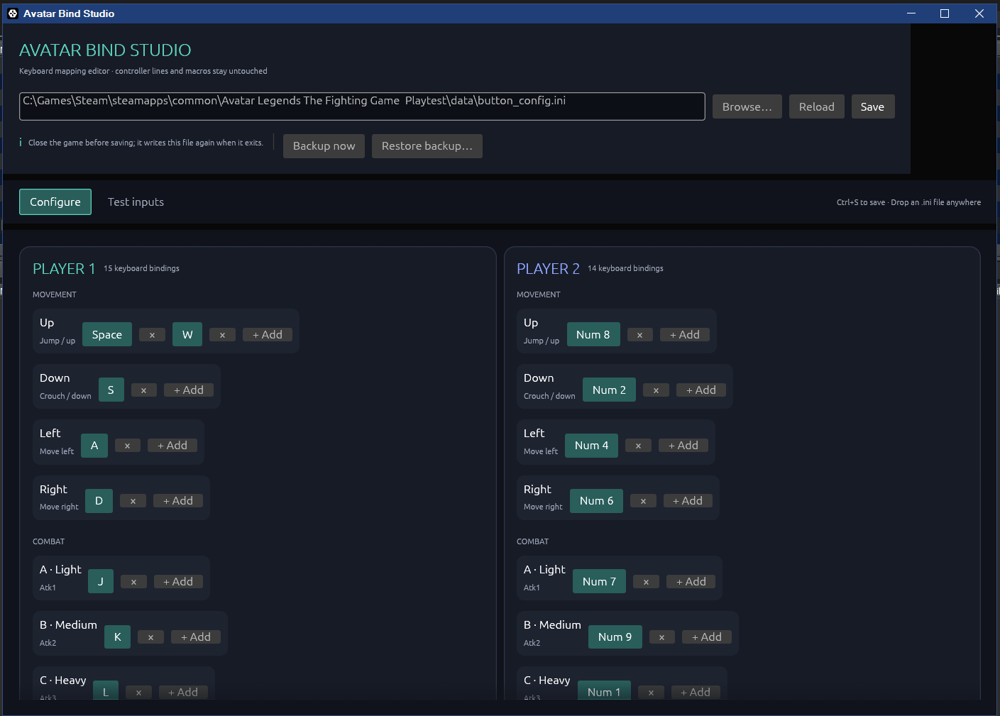
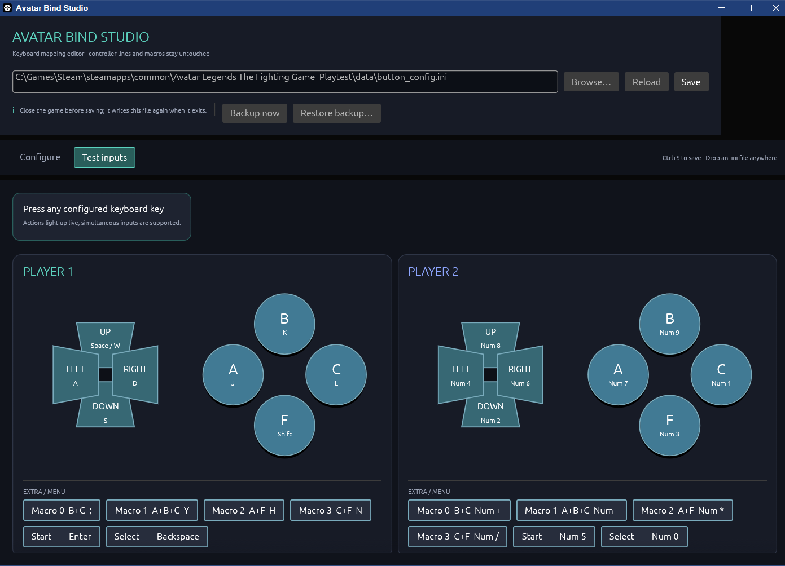

# Avatar Bind Studio

A small native Windows editor for `button_config.ini` from **Avatar Legends: The Fighting Game**.

## Download for Windows

### [Download Avatar Bind Studio.exe](https://github.com/stmSi/avatar-legends-keybind-editor/releases/latest/download/Avatar-Bind-Studio.exe)

No Rust, programming tools, or installation is required. Download the `.exe`, close the game, and run it. The usual Steam playtest config is detected automatically; `Browse…` can select another `button_config.ini`.

Windows may show an unknown-publisher warning because this community build is not code-signed. Choose **More info → Run anyway** if you trust this repository.

## Screenshots

### Configure both players



### Test keys and macros live



## Features

- Automatically finds the Steam playtest config on this PC.
- Edits Player 1 and Player 2 keyboard bindings without disturbing comments, macros, or controller mappings.
- Click any key chip, then press the replacement key.
- Adds and removes extra bindings for an action.
- Shows conflict warnings only when the same physical keyboard key is assigned more than once.
- Hovering one conflicting binding highlights every other binding in the same conflict group.
- Live Test Inputs view lights up every game action triggered by the keys you press.
- Macro buttons expand visually: pressing Atk6/8/9/10 also lights the A/B/C/F and directional controls defined by that player's Macro 0–3 lines.
- Creates numbered snapshots in `button_config_backups` automatically before every save.
- Includes `Backup now` and `Restore backup…`; restored snapshots are previewed in the editor before they replace the live config.

Close the game before saving. The game writes its in-memory controls back to the config when it exits.

## Build

Players do not need this section. It is only for contributors building from source.

```powershell
cargo build --release
```
